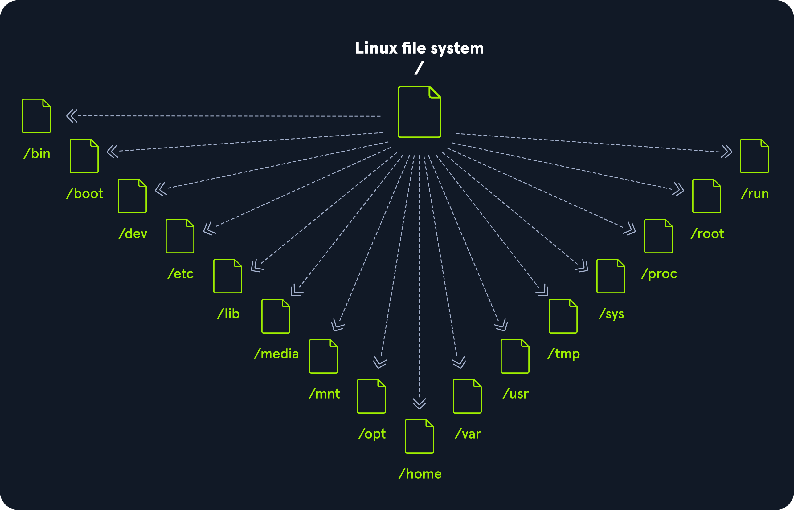
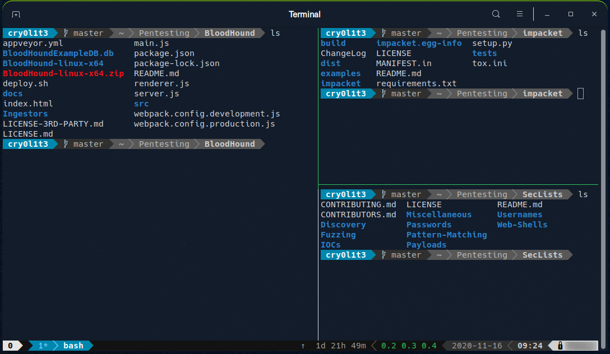
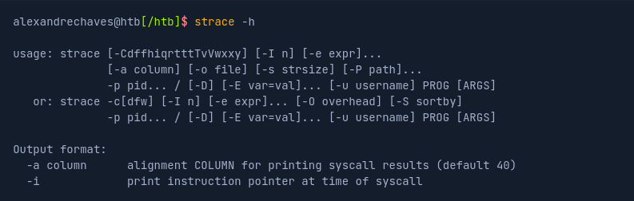
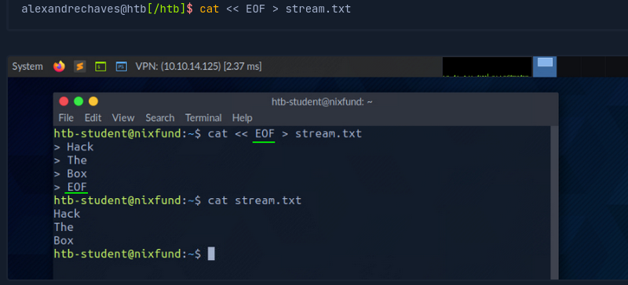
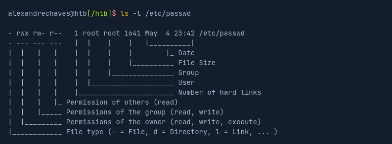

# Fundamentos Linux

Muitos eventos levaram à criação do primeiro kernel Linux e, finalmente, do sistema operacional Linux (OS), começando com o lançamento do sistema operacional Unix por Ken Thompson e Dennis Ritchie (que ambos trabalhavam para a AT & T na época) em 1970. O Berkeley Software Distribution (BSD) foi lançado em 1977, mas uma vez que continha o código Unix de propriedade da AT&T, um processo resultante limitou o desenvolvimento do BSD. Richard Stallman iniciou o projeto GNU em 1983. Seu objetivo era criar um sistema operacional livre semelhante ao Unix, e parte de seu trabalho resultou na criação da GNU General Public License (GPL). Projetos de outros ao longo dos anos não resultaram em um kernel livre e funcional que se tornaria amplamente adotado até a criação do kernel Linux. 

No início, o Linux era um projeto pessoal iniciado em 1991 por um estudante finlandês chamado Linus Torvalds. Seu objetivo era criar um novo kernel de sistema operacional livre. Ao longo dos anos, o kernel Linux passou de um pequeno número de arquivos escritos em C sob licenciamento que proibia a distribuição comercial para a versão mais recente com mais de 23 milhões de linhas de código-fonte (comentários excluídos), licenciados sob a GNU General Public License v2. O Linux está disponível em mais de 600 distribuições (ou um sistema operacional baseado no kernel Linux e software e bibliotecas de suporte). Alguns dos mais populares e conhecidos são Ubuntu, Debian, Fedora, OpenSUSE, elementary, Manjaro, Gentoo Linux, RedHat e Linux Mint.

O Linux é geralmente considerado mais seguro do que outros sistemas operacionais e, embora tenha tido muitas vulnerabilidades do kernel no passado, está se tornando cada vez menos frequente. É menos suscetível a malware do que os sistemas operacionais Windows e é atualizado com muita frequência. O Linux também é muito estável e geralmente oferece um desempenho muito alto para o usuário final. No entanto, pode ser mais difícil para iniciantes e não tem tantos drivers de hardware quanto o Windows.

Como o Linux é livre e de código aberto, o código-fonte pode ser modificado e distribuído comercialmente ou não comercialmente por qualquer pessoa. Os sistemas operacionais baseados em Linux são executados em servidores, mainframes, desktops, sistemas embarcados, como roteadores, televisores, consoles de videogame e muito mais. O sistema operacional Android geral que é executado em smartphones e tablets é baseado no kernel Linux e, por isso, o Linux é o sistema operacional mais amplamente instalado. Linux é um sistema operacional como Windows, iOS, Android ou macOS. Um sistema operacional é um software que gerencia todos os recursos de hardware associados ao nosso computador. Isso significa que um sistema operacional gerencia toda a comunicação entre software e hardware. Além disso, existem muitas distribuições diferentes (distro). É como uma versão dos sistemas operacionais Windows.

Com as instâncias interativas, temos acesso ao Pwnbox, uma versão personalizada do Parrot OS. Este será o sistema operacional principal com o qual trabalharemos através dos módulos. Parrot OS é uma distribuição Linux baseada em Debian que se concentra em segurança, privacidade e desenvolvimento.

 **O Linux segue cinco princípios fundamentais:**

Tudo é um arquivo: “Todos os arquivos de configuração para os vários serviços em execução no sistema operacional Linux são armazenados em um ou mais arquivos de texto.”

Programas pequenos e de propósito único: “O Linux oferece muitas ferramentas diferentes com as quais trabalharemos, que podem ser combinadas para trabalhar em conjunto.”

Capacidade de encadear programas para executar tarefas complexas:  “A integração e combinação de diferentes ferramentas nos permite realizar muitas tarefas grandes e complexas, como processar ou filtrar resultados de dados específicos.”

Evite interfaces de usuário cativas: “Linux é projetado para trabalhar principalmente com o shell (ou terminal), o que dá ao usuário maior controle sobre o sistema operacional.”

Dados de configuração armazenados em um arquivo de texto: “Um exemplo de tal arquivo é o arquivo /etc/passwd, que armazena todos os usuários registrados no sistema.”

**Componentes**

Bootloader: Um pedaço de código que é executado para orientar o processo de inicialização para iniciar o sistema operacional. O Parrot Linux usa o GRUB Bootloader.

OS Kernel: O kernel é o principal componente de um sistema operacional. Ele gerencia os recursos para dispositivos de E/S do sistema no nível de hardware.

Daemons: Os serviços em segundo plano são chamados de "daemons" no Linux. Seu objetivo é garantir que as principais funções, como agendamento, impressão e multimídia, estejam funcionando corretamente. Esses pequenos programas são carregados depois que inicializamos ou fazemos login no computador.

OS Shell: O shell do sistema operacional ou o interpretador de linguagem de comando (também conhecido como linha de comando) é a interface entre o sistema operacional e o usuário. Essa interface permite que o usuário diga ao sistema operacional o que fazer. As conchas mais comumente usadas são Bash, Tcsh/Csh, Ksh, Zsh e Fish.

Servidor gráfico: Isso fornece um subsistema gráfico (servidor) chamado "X" ou "X-server" que permite que programas gráficos sejam executados local ou remotamente no sistema X-windowing.

Window Manager: Também conhecida como interface gráfica do usuário (GUI). Há muitas opções, incluindo GNOME, KDE, MATE, Unity e Cinnamon. Um ambiente de desktop geralmente tem vários aplicativos, incluindo arquivos e navegadores da Web. Isso permite que o usuário acesse e gerencie os recursos e serviços essenciais e acessados com frequência de um sistema operacional.

## Arquitetura Linux

**O sistema operacional Linux pode ser dividido em camadas:**

Hardware: Dispositivos periféricos, como a RAM do sistema, disco rígido, CPU e outros.

Kernel: O núcleo do sistema operacional Linux cuja função é virtualizar e controlar recursos comuns de hardware do computador, como CPU, memória alocada, dados acessados e outros. O kernel dá a cada processo seus próprios recursos virtuais e evita/mitiga conflitos entre diferentes processos.

Shell: Uma interface de linha de comando (CLI), também conhecida como shell na qual um usuário pode inserir comandos para executar as funções do kernel.

Utilitário do sistema: Disponibiliza ao usuário todas as funcionalidades do sistema operacional.

## Hierarquia do sistema de arquivos

O sistema operacional Linux é estruturado em uma hierarquia semelhante a uma árvore e está documentado no FileSystem Hierarchy
Padrão (ESF). O Linux é estruturado com os seguintes diretórios padrão de nível superior:

[FileSystem Hierarchy](https://www.pathname.com/fhs/)

/: O diretório de nível superior é o sistema de arquivos raiz e contém todos os arquivos necessários para inicializar o sistema operacional antes que outros sistemas de arquivos sejam montados, bem como os arquivos necessários para inicializar os outros sistemas de arquivos. Após a inicialização, todos os outros sistemas de arquivos são montados em pontos de montagem padrão como subdiretórios da raiz.

/bin: Contém binários de comando essenciais.

/boot: Consiste no carregador de inicialização estático, no executável do kernel e nos arquivos necessários para inicializar o sistema operacional Linux.

/dev: Contém arquivos de dispositivo para facilitar o acesso a todos os dispositivos de hardware conectados ao sistema.

/etc: Arquivos de configuração do sistema local. Os arquivos de configuração para aplicativos instalados também podem ser salvos aqui.

/home: Cada usuário no sistema tem um subdiretório aqui para armazenamento.

/lib: Arquivos de biblioteca compartilhada que são necessários para a inicialização do sistema.

/media: Dispositivos de mídia removíveis externos, como unidades USB, são montados aqui.

/mnt: Ponto de montagem temporário para sistemas de arquivos regulares.

/opt: Arquivos opcionais, como ferramentas de terceiros, podem ser salvos aqui.

/root: Diretório base do usuário root.

/sbin: Este diretório contém executáveis usados para administração do sistema (arquivos binários do sistema).

/tmp: O sistema operacional e muitos programas usam esse diretório para armazenar arquivos temporários. Este diretório é geralmente limpo após a inicialização do sistema e pode ser excluído em outros momentos sem qualquer aviso.

/usr: Contém executáveis, bibliotecas, arquivos man, etc.

/var: Esse diretório contém arquivos de dados variáveis, como arquivos de log, caixas de entrada de e-mail, arquivos relacionados a aplicativos Web, arquivos cron e muito mais.

## Introdução ao Shell

É crucial aprender a usar o shell do Linux, pois existem muitos servidores baseados no Linux. Estes são frequentemente usados porque o Linux é menos propenso a erros, em oposição aos servidores Windows. Por exemplo, os servidores web são frequentemente baseados no Linux. Saber como usar o sistema operacional para controlá-lo efetivamente requer entender e dominar a parte essencial do Linux.

Um terminal Linux, também chamado de shell ou linha de comando, fornece uma interface de entrada/saída (E/S) baseada em texto entre os usuários e o kernel para um sistema de computador. O termo console também é típico, mas não se refere a uma janela, mas a uma tela no modo de texto. Na janela do terminal, comandos podem ser executados para controlar o sistema.

**Emuladores de terminal**

Emuladores de terminal são frequentemente usados para isso. A emulação de terminal é um software que emula a função de um terminal. Ele permite o uso de programas baseados em texto dentro de uma interface gráfica do usuário (GUI). Existem muitos emuladores de terminal diferentes, como o GNOME Terminal, o XFCE4 Terminal, o XTerm e muitos outros. Existem também as chamadas interfaces de linha de comando que são executadas como terminais adicionais em um terminal e, portanto, são multiplexadores. Esses multiplexadores incluem Tmux, GNU Screen e outros. Em suma, um terminal serve como uma interface para o interpretador de shell.

Emuladores de terminal e multiplexadores são extensões benéficas para o terminal. Eles nos fornecem diferentes métodos e funções para trabalhar com o terminal, como dividir o terminal em uma janela, trabalhar em vários diretórios, criar diferentes espaços de trabalho e muito mais. Um exemplo do uso de tal multiplexador chamado Tmux poderia ser algo assim:

**Shell**

O shell mais comumente usado no Linux é o Bourne-Again Shell (BASH) e faz parte do projeto GNU. Tudo o que fazemos através da GUI podemos fazer com o shell. O shell nos dá muito mais possibilidades de interagir com programas e processos para obter informações mais rapidamente. Além disso, muitos processos podem ser facilmente automatizados com scripts menores ou maiores que tornam o trabalho manual muito mais fácil. Além do Bash, também existem outros como: Tcsh/Csh, Ksh, Zsh, Fish shell.

**Descrição do Prompt**

O prompt bash é fácil de entender e, por padrão, inclui informações como o usuário, o nome do host e o diretório de trabalho atual. O formato pode ter a seguinte aparência:

O diretório base de um usuário é marcado com um til e é a pasta padrão quando fazemos login.

O cifrão, neste caso, significa um usuário. Assim que efetuamos login como root, o caractere muda para um hash e tem a seguinte aparência:

Vimos aqui o mesmo que quando trabalhamos na GUI do Windows. Estamos logados como um usuário em um computador com um nome específico, e sabemos em qual diretório estamos quando navegamos pelo nosso sistema. O prompt Bash também pode ser personalizado e alterado para nossas próprias necessidades. O ajuste do prompt bash está fora do escopo deste módulo. No entanto, podemos olhar para o bashrcgenerator  e powerline  o que nos dá a possibilidade de adaptar o nosso pronto às nossas necessidades.

[bashrcgenerator](https://bashrcgenerator.com/)

[powerline](https://bashrcgenerator.com/)

## Informações do Sistema

Como trabalharemos com muitos sistemas Linux diferentes, precisamos aprender a estrutura e as informações sobre o sistema, seus processos, configurações de rede, usuários, diretórios, configurações de usuário e os parâmetros correspondentes. Aqui está uma lista das ferramentas necessárias que nos ajudarão a obter as informações acima. A maioria deles é instalada por padrão.

| **Comando** | **Descrição** |
| --------------|-------------------|
| `whoami` | Exibe o nome de usuário atual. |
| `id` | Retorna a identidade dos usuários. |
| `hostname` | Define ou imprime o nome do sistema host atual. |
| `uname` | Imprime informações básicas sobre o nome do sistema operacional e o hardware do sistema. |
| `pwd` | Retorna o nome do diretório de trabalho. |
| `ifconfig` | O utilitário ifconfig é usado para atribuir ou exibir um endereço a uma interface de rede e/ou configurar parâmetros de interface de rede. |
| `ip` | Ip é um utilitário para mostrar ou manipular roteamento, dispositivos de rede, interfaces e túneis. |
| `netstat` | Mostra o status da rede. |
| `ss` | Outro utilitário para investigar soquetes. |
| `ps` | Mostra o status do processo. |
| `who` | Exibe quem está conectado. |
| `eny` | Imprime o ambiente ou define e executa o comando. |
| `lsblk` | Lista dispositivos de bloqueio. |
| `lsusb` | Lista usb dispositivo. |
| `lsof` | Lista os arquivos abertos. |
| `lspci` | Lista dispositivos PCI. |

**Hostname**

O comando hostname é bastante autoexplicativo e apenas imprimirá o nome do computador em que estamos logados.

**Whoami**

Este comando rápido e fácil pode ser usado em sistemas Windows e Linux para obter nosso nome de usuário atual. Durante uma avaliação de segurança, obtemos acesso reverso ao shell em um host, e um dos primeiros bits de consciência situacional que devemos fazer é descobrir com qual usuário estamos executando. A partir daí, podemos descobrir se o usuário tem algum privilégio / acesso especial.

**Id**

O comando id expande o comando whoami e imprime nossa associação e IDs de grupo efetivos. Isso pode ser de interesse para os testadores de penetração que procuram ver que acesso um usuário pode ter e administradores de sistemas que procuram auditar permissões de conta e associação ao grupo. Nesta saída, o grupo hackthebox é de interesse porque não é padrão, o grupo adm significa que o usuário pode ler arquivos de log em /var/log e poderia potencialmente obter acesso a informações confidenciais, a associação ao grupo sudo é de particular interesse, pois isso significa que nosso usuário pode executar alguns ou todos os comandos como o usuário root todo-poderoso. Os direitos Sudo podem nos ajudar a escalar privilégios ou podem ser um sinal para um administrador de sistemas de que eles podem precisar auditar permissões e associações de grupo para remover qualquer acesso que não seja necessário para que um determinado usuário realize suas tarefas diárias.

**Uname**

Vamos nos aprofundar um pouco mais no comando uname. Se digitarmos man uname em nosso terminal, abriremos a página do manual para o comando, que mostrará as possíveis opções que podemos executar com o comando e os resultados.
A execução do uname -a imprimirá todas as informações sobre a máquina em uma ordem específica: nome do kernel, nome do host, versão do kernel, versão do kernel, nome do hardware da máquina e sistema operacional. O sinalizador -a omitirá -p (tipo de processador) e -i (plataforma de hardware) se forem desconhecidos.

A partir do comando abaixo, podemos ver que o nome do kernel é Linux, o nome do host é box, a versão do kernel é 4.15.0-99-generic, a versão do kernel é #100-Ubuntu SMP Qua 22 de abril 20:32:56 UTC 2020, e assim por diante. Executar qualquer uma dessas opções por conta própria nos dará a saída de bits específica em que estamos interessados.
Suponha que desejemos imprimir a versão do kernel para procurar possíveis explorações do kernel rapidamente. Podemos digitar uname -r para obter essas informações.
Com esta informação, poderíamos ir e procurar por "4.15.0-99-generic exploit", e o primeiro resultado imediatamente nos parece útil.
É altamente recomendável estudar os comandos e entender para que servem e quais informações eles podem fornecer. Embora um pouco tedioso, podemos aprender muito estudando as manpages para comandos comuns. Podemos até descobrir coisas que nem sabíamos que eram possíveis com um determinado comando. Essas informações não são usadas apenas para trabalhar com Linux. No entanto, ele também será usado posteriormente para descobrir vulnerabilidades e configurações incorretas no sistema Linux que podem contribuir para o escalonamento de privilégios.

[Exploit](https://www.exploit-db.com/exploits/47163)

## Gerenciamento de Usuários

O gerenciamento de usuários é uma parte essencial da administração do Linux. Às vezes, precisamos criar novos usuários ou adicionar outros usuários a grupos específicos. Outra possibilidade é executar comandos como um usuário diferente. Afinal, não é muito raro que usuários de apenas um grupo específico tenham permissões para visualizar ou editar arquivos ou diretórios específicos. Isso, por sua vez, nos permite coletar mais informações localmente na máquina, o que pode ser muito importante.
O gerenciamento de usuários é essencial em qualquer sistema operacional, e a melhor maneira de se familiarizar com ele é experimentar os comandos individuais em conjunto com suas várias opções.

 **Comando** | **Descrição** |
| --------------|-------------------|
| `sudo` | Executa o comando como um usuário diferente. |
| `su` | O utilitário su solicita credenciais de usuário apropriadas via PAM(abreviação de Pluggable Authentication Modules) e alterna para esse ID de usuário (o usuário padrão é o superusuário). Um shell é então executado. |
| `useradd` | Cria um novo usuário ou atualiza as informações padrão de novo usuário. |
| `userdel` | Exclui uma conta de usuário e arquivos relacionados. |
| `usermod` | Modifica uma conta de usuário. |
| `delgroup` | Remove um grupo do sistema. |
| `passwd` | Altera a senha do usuário. |

## Gerenciamento de Pacotes

Seja trabalhando como administrador de sistema, mantendo nossas próprias máquinas Linux em casa ou construindo/atualizando/mantendo nossa distribuição de testes de penetração de escolha, é crucial ter uma compreensão firme dos gerenciadores de pacotes Linux disponíveis e das várias maneiras de utilizá-los para instalar, atualizar ou remover pacotes. Os pacotes são arquivos que contêm binários de software, arquivos de configuração, informações sobre dependências e acompanhar atualizações e upgrades. Os recursos que a maioria dos sistemas de gerenciamento de pacotes fornece são:

* Download de Pacotes
* Resolução de Dependência
* Um formato de pacote Padrão
* Locais Comuns de instalação e configuração
* Configuração e funcionalidade adicionais relacionadas ao sistema
* Controle de qualidade

Podemos usar muitos sistemas de gerenciamento de pacotes diferentes que cobrem diferentes tipos de arquivos, como ".deb", ".rpm" e outros. O requisito de gerenciamento de pacotes é que o software a ser instalado esteja disponível como um pacote correspondente. Normalmente, isso é criado, oferecido e mantido centralmente em distribuições Linux. Desta forma, o software é integrado diretamente no sistema, e seus vários diretórios são distribuídos por todo o sistema. As alterações de software de gerenciamento de pacotes no sistema para instalar o pacote são retiradas do pacote e implementadas pelo software de gerenciamento de pacotes. Se o software de gerenciamento de pacotes reconhecer que pacotes adicionais são necessários para o bom funcionamento do pacote que ainda não foi instalado, uma dependência será incluída e avisará o administrador ou tentará recarregar o software ausente de um repositório, por exemplo, e instalá-lo com antecedência.

Se um software instalado tiver sido excluído, o sistema de gerenciamento de pacotes retomará as informações do pacote, modifica-o com base em sua configuração e excluirá os arquivos. Existem diferentes programas de gerenciamento de pacotes que podemos usar para isso. Aqui está uma lista de exemplos de tais programas:

**Dpkg**

O dpkg é uma ferramenta para instalar, construir, remover e gerenciar pacotes Debian. O front-end principal e mais fácil de usar para o dpkg é a aptidão.

**Apt**

O Apt fornece uma interface de linha de comando de alto nível para o sistema de gerenciamento de pacotes.

**Aptitude**

Aptitude é uma alternativa ao apt e é uma interface de alto nível para o gerenciador de pacotes.

**Snap**

Instala, configura, atualiza e remova pacotes de snap. Os snaps permitem a distribuição segura dos aplicativos e utilitários mais recentes para a nuvem, servidores, desktops e a Internet das Coisas.

**Gem**

O Gem é o front-end do RubyGems, o gerenciador de pacotes padrão do Ruby.

**Pip**

Pip é um instalador de pacotes Python recomendado para instalar pacotes Python que não estão disponíveis no repositório Debian. Ele pode trabalhar com repositórios de controle de versão (atualmente apenas repositórios Git, Mercurial e Bazaar), registra a saída extensivamente e impede instalações parciais baixando todos os requisitos antes de iniciar a instalação.

**Git**

O Git é um sistema de controle de revisão rápido, escalável e distribuído com um conjunto de comandos excepcionalmente rico que fornece operações de alto nível e acesso total aos internos.

## Gerenciador Avançado de Pacotes (APT)

As distribuições Linux baseadas em Debian usam o gerenciador de pacotes APT. Um pacote é um arquivo morto que contém vários arquivos ".deb". O utilitário dpkg é usado para instalar programas a partir do arquivo ".deb" associado. O APT facilita a atualização e a instalação de programas porque muitos programas têm dependências. Ao instalar um programa a partir de um arquivo ".deb" autônomo, podemos nos deparar com problemas de dependência e precisar baixar e instalar um ou vários pacotes adicionais. O APT torna isso mais fácil e eficiente, empacotando todas as dependências necessárias para instalar um programa.

Cada distribuição Linux usa repositórios de software que são atualizados com frequência. Quando atualizamos um programa ou instalamos um novo, o sistema consulta esses repositórios para o pacote desejado. Os repositórios podem ser rotulados como estáveis, de teste ou instáveis. A maioria das distribuições Linux utiliza o repositório mais estável ou "principal". Isso pode ser verificado visualizando.

O APT usa um banco de dados chamado cache do APT. Isso é usado para fornecer informações sobre pacotes instalados em nosso sistema off-line. Podemos pesquisar o cache APT, por exemplo, para encontrar todos os pacotes relacionados ao Impacket.

Podemos então ver informações adicionais sobre um pacote.

Também podemos listar todos os pacotes instalados.

Se estivermos faltando alguns pacotes, podemos procurá-lo e instalá-lo usando o seguinte comando.

**DPKG**

Também podemos baixar os programas e ferramentas dos repositórios separadamente. Neste exemplo, baixamos 'strace' para o Ubuntu 18.04 LTS.

Além disso, agora podemos usar o apt e o dpkg para instalar o pacote. Como já trabalhamos com o apt, vamos nos voltar para o dpkg no próximo exemplo.

Com isso, já instalamos a ferramenta e podemos testar se ela funciona corretamente.

## Gerenciamento de Serviços e Processos

Em geral, existem dois tipos de serviços: internos, os serviços relevantes que são necessários na inicialização do sistema, que, por exemplo, executam tarefas relacionadas ao hardware, e serviços que são instalados pelo usuário, que geralmente incluem todos os serviços do servidor. Esses serviços são executados em segundo plano sem qualquer interação do usuário. Estes também são chamados de daemons e são identificados pela letra 'd' no final do nome do programa, por exemplo, sshd ou systemd.

A maioria das distribuições Linux agora mudou para systemd. Este daemon é um processo Init iniciado primeiro e, portanto, tem o ID do processo (PID) 1. Este daemon monitora e cuida do início e da parada ordenados de outros serviços. Todos os processos têm um PID atribuído que pode ser visualizado em /proc/ com o número correspondente. Esse processo pode ter um ID de processo pai (PPID), conhecido como processo filho.

Além do systemctl, também podemos usar update-rc.d para gerenciar links de script de inicialização do SysV. Vejamos alguns exemplos. Usaremos o servidor OpenSSH nestes exemplos. Se não tivermos isso instalado, instale-o antes de prosseguir para esta seção.

**Systemctl**

Depois de instalar o OpenSSH em nossa VM, podemos iniciar o serviço com o seguinte comando:
<code>systemctl start ssh</code>

Depois de iniciarmos o serviço, agora podemos verificar se ele é executado sem erros

Para adicionar OpenSSH ao script SysV para dizer ao sistema para executar este serviço após a inicialização, podemos vinculá-lo com o seguinte comando:

<code>systemctl enable ssh</code>

Uma vez que reinicializamos o sistema, o servidor OpenSSH será executado automaticamente. Podemos verificar isso com uma ferramenta chamada ps.

<code>ps -aux | grep ssh</code>

Também podemos usar systemctl para listar todos os serviços.

É bem possível que os serviços não sejam iniciados devido a um erro. Para ver o problema, podemos usar a ferramenta journalctl para visualizar os logs.

## Matar um processo

Um processo pode estar nos seguintes estados:

* Executando
* Aguardando (aguardando um evento ou recurso do sistema)
*  Parado
* Zombie (parado, mas ainda tem uma entrada na tabela de processo)

Os processos podem ser controlados usando kill, pkill, pgrep e killall. Para interagir com um processo, devemos enviar um sinal para ele. Podemos visualizar todos os sinais com o seguinte comando:

<code>kill -l</code>

Os mais utilizados são:

sighup: Isso é enviado para um processo quando o terminal que o controla é fechado.

Sigint: Enviado quando um usuário pressiona [Ctrl] + C no terminal de controle para interromper um processo.

Sigquit: Enviado quando um usuário pressiona [Ctrl] + D para sair.

Sigkill: Mate imediatamente um processo sem operações de limpeza.

Sigterm: Encerra o programa.

Sigstop: Para o programa. Não pode mais ser tratado.

Sigtstp: Enviado quando um usuário pressiona [Ctrl] + Z para solicitar a suspensão de um serviço. O usuário pode lidar com isso depois.

## Executar Vários Comandos

Existem três possibilidades para executar vários comandos, um após o outro. Estes são separados por:

* Ponto e vírgula (;)
* Duplo comercial (&&)
* Pipes (|)

A diferença entre eles está no tratamento dos processos anteriores e depende se o processo anterior foi concluído com sucesso ou com erros. O ponto e vírgula (;) é um separador de comandos e executa os comandos ignorando os resultados e erros dos comandos anteriores.

Por exemplo, se executarmos o mesmo comando, mas o substituirmos em segundo lugar, o comando ls por um arquivo que não existe, obteremos um erro e o terceiro comando será executado no entanto.

No entanto, parece diferente se usarmos os caracteres duplos E (&&) para executar os comandos um após o outro. Se houver um erro em um dos comandos, os seguintes não serão mais executados e todo o processo será interrompido.

Os pipes (|) dependem não apenas da operação correta e livre de erros dos processos anteriores, mas também dos resultados dos processos anteriores. Trataremos dos pipes mais adiante na seção Descritores e redirecionamentos de arquivo.

## Trabalhando com Web Services

Outro componente essencial é a comunicação com os servidores web. Existem muitas maneiras diferentes de configurar servidores web em sistemas operacionais Linux. Um dos servidores web mais utilizados e difundidos, além do IIS e Nginx, é o Apache. Para um servidor web Apache, podemos usar módulos apropriados, que podem criptografar a comunicação entre o navegador e o servidor web (mod_ssl), usar como um servidor proxy (mod_proxy) ou executar manipulações complexas de dados de cabeçalho HTTP (mod_headers) e URLs (mod_rewrite). O Apache oferece a possibilidade de criar páginas da Web dinamicamente usando linguagens de script do lado do servidor. As linguagens de script comumente usadas são PHP, Perl ou Ruby. Outras linguagens são Python, JavaScript, Lua e.NET, que podem ser usadas para isso. Podemos instalar o servidor web Apache com o seguinte comando.

Depois de iniciá-lo, podemos navegar usando nosso navegador até a página padrão (http://localhost).

**Curl**

É uma ferramenta que nos permite transferir arquivos do shell através de protocolos como HTTP, HTTPS, FTP, SFTP, FTPS ou SCP. Esta ferramenta nos dá a possibilidade de controlar e testar sites remotamente. Além do conteúdo dos servidores remotos, também podemos visualizar solicitações individuais para analisar a comunicação do cliente e do servidor. Normalmente, o cURL já está instalado na maioria dos sistemas Linux. Esta é outra razão crítica para nos familiarizarmos com esta ferramenta, pois pode tornar alguns processos muito mais fáceis mais tarde.

**Wget**

Uma alternativa ao enrolamento é a ferramenta wget. Com esta ferramenta, podemos baixar arquivos de servidores FTP ou HTTP diretamente do terminal e serve como um bom gerenciador de downloads. Se usarmos o wget da mesma maneira, a diferença para o curl é que o conteúdo do site é baixado e armazenado localmente, como mostrado no exemplo a seguir

**Python 3**

Outra opção que é frequentemente usada quando se trata de transferência de dados é o uso do Python 3. Nesse caso, o diretório raiz do servidor Web é onde o comando é executado para iniciar o servidor. Para este exemplo, estamos em um diretório onde o WordPress está instalado e contém um "readme.html". Agora, vamos iniciar o servidor web Python 3 e ver se podemos acessá-lo usando o navegador.

## Navegação

Uma das melhores maneiras de aprender algo novo é experimentá-lo. Aqui abordamos as seções sobre como navegar pelo Linux, criar, mover, editar e excluir arquivos e pastas, encontrá-los no sistema operacional, diferentes tipos de redirecionamentos e quais são os descritores de arquivos. Em seguida, encontraremos alguns atalhos que facilitarão nosso trabalho com o shell. Comecemos pela navegação. Antes de nos movermos pelo sistema, temos que descobrir em qual diretório estamos. Podemos descobrir onde estamos com o comando <code>pwd</code>

Somente o comando <code>ls</code>  é necessário para a navegação. Ele tem muitas opções adicionais que podem complementar a exibição do conteúdo.
No entanto, não veremos tudo. Para listar o conteúdo de um diretório, não precisamos necessariamente navegar até lá primeiro. Também podemos usar "ls" para especificar o caminho onde queremos saber o conteúdo. <code>ls -l var</code>

Podemos fazer a mesma coisa se quisermos navegar até o diretório. Para percorrer os diretórios, usamos o comando cd. Vamos mudar para o diretório /dev/shm. Claro, podemos ir para o diretório /dev primeiro e depois /shm. No entanto, também podemos entrar diretamente no caminho completo e pular diretamente para lá.

Como estávamos no diretório home antes, podemos voltar rapidamente para o diretório em que estávamos por último.
<code>cd -</code>

O shell também nos oferece a função de preenchimento automático, o que facilita a navegação. Se agora digitarmos cd /dev/s e, em seguida, pressionarmos [TAB] duas vezes, obteremos todas as entradas começando com a letra "s" no diretório de /dev/.

Se adicionarmos a letra "h" à letra "s", o shell completará a entrada, caso contrário, não haverá pastas neste diretório começando com as letras "sh". Se agora exibirmos todo o conteúdo do diretório, veremos apenas o seguinte conteúdo.

A primeira entrada com um único ponto (.) indica o diretório atual em que estamos atualmente. A segunda entrada com dois pontos (..) representa o diretório pai /dev. Isso significa que podemos saltar para o diretório pai com o seguinte comando.
<code>cd..</code>

Como nosso shell é preenchido com alguns registros, podemos limpá-lo com o comando <code>clear</code>

## Trabalahndo com Arquivos e Diretórios

Criar, mover e copiar

Em seguida, vamos trabalhar com arquivos e diretórios e aprender a criar, renomear, mover, copiar e excluir. Primeiro, vamos criar um arquivo vazio e um diretório. Podemos usar o toque para criar um arquivo vazio e <code>mkdir</code> para criar um diretório. A sintaxe para isso é a seguinte:
mkdir diretório.

Cria um arquivo vazio

Criar um diretório

Podemos querer ter diretórios específicos no diretório, e seria muito demorado criar esse comando para cada diretório. O comando mkdir tem uma opção marcada -p para adicionar diretórios pai.

Podemos examinar toda a estrutura depois de criar os diretórios pai com o comando <code>tree</code>.

Com o comando <code>mv</code> , podemos mover e também renomear arquivos e diretórios. A sintaxe para isso tem esta aparência:

Primeiro, vamos renomear as informações do arquivo.txt para informações.txt e, em seguida, movê-lo para o diretório Storage.

Agora vamos criar um arquivo chamado readme.txt no diretório atual e, em seguida, copiar as informações dos arquivos.txt e leiame.txt para o diretório Storage/.
<code>Touch</code> readme.txt

Mover arquivos para um diretório específico

Copiar readme.txt

## Editando Arquivos

Há várias maneiras de editar um arquivo. Um dos editores de texto mais comuns para isso é Vi e Vim. Mais raramente, há o editor Nano. Vamos primeiro lidar com o editor Nano aqui, pois é um pouco mais fácil de entender. Podemos criar um novo arquivo diretamente com o editor Nano, especificando o nome do arquivo diretamente como o primeiro parâmetro. Nesse caso, criamos um novo arquivo chamado notes.txt

Exemplo: <code>nano</code> notes.txt

Acima vemos duas linhas com breves descrições. O acento circunflexo (^) significa a nossa tecla "[CTRL]". Por exemplo, se pressionarmos [CTRL + W], uma linha "Pesquisar:" aparecerá na parte inferior do editor, onde podemos inserir a palavra ou palavras que estamos procurando. Se agora procurarmos a palavra "nós" e pressionarmos [ENTER], o cursor se moverá para a primeira palavra que corresponder.

Para saltar para a próxima partida com o cursor, pressionamos [CTRL + W] novamente e confirmamos com [ENTER] sem nenhuma informação adicional.

Agora podemos salvar o arquivo pressionando [CTRL + O] e confirmar o nome do arquivo com [ENTER].

Depois de salvar o arquivo, podemos deixar o editor com [CTRL + X].

## Localizar Arquivos e diretórios

É crucial ser capaz de encontrar os arquivos e pastas que precisamos. Uma vez que tenhamos obtido acesso a um sistema baseado em Linux, será essencial encontrar arquivos de configuração, scripts criados por usuários ou pelo administrador e outros arquivos e pastas. Não precisamos navegar manualmente por todas as pastas e verificar quando modificadas pela última vez. Existem algumas ferramentas que podemos usar para facilitar esse trabalho.

**Wich**
Uma das ferramentas comuns é which. Essa ferramenta retorna o caminho para o arquivo ou link que deve ser executado. Isso nos permite determinar se programas específicos, como cURL, netcat, wget, python, gcc, estão disponíveis no sistema operacional. Vamos usá-lo para procurar Python em nossa instância interativa.

Se o programa que pesquisamos não existir, nenhum resultado será exibido.

**Find**
Outra ferramenta útil é find. Além da função para localizar arquivos e pastas, esta ferramenta também contém a função para filtrar os resultados. Podemos usar parâmetros de filtro como o tamanho do arquivo ou a data. Também podemos especificar se pesquisamos apenas arquivos ou pastas.
Vejamos um exemplo de como seria tal comando com várias opções.

<code>-type f</code> Assim, definimos o tipo do objeto pesquisado. Neste caso, 'f' significa 'arquivo'.

<code>-name *.conf Com '-name'</code> indicamos o nome do arquivo que estamos procurando. O asterisco (*) significa 'todos' os arquivos com a extensão '.conf'.

<code>-user root</code> Essa opção filtra todos os arquivos cujo proprietário é o usuário root.

<code>-size +20k</code> Podemos então filtrar todos os arquivos localizados e especificar que só queremos ver os arquivos que são maiores que 20 KiB.

<code>-newermt 2020-03-03</code> Com esta opção, definimos a data. Somente os arquivos mais recentes que a data especificada serão apresentados.

<code>-exec ls -al {} \;</code>  Essa opção executa o comando especificado, usando os colchetes como espaços reservados para cada resultado. A barra invertida escapa que o próximo caractere seja interpretado pelo shell porque, caso contrário, o ponto-e-vírgula encerraria o comando e não alcançaria o redirecionamento.

<code>2>/dev/null</code>  Este é um redirecionamento STDERR para o 'dispositivo nulo', ao qual voltaremos na próxima seção. Esse redirecionamento garante que nenhum erro seja exibido no terminal. Esse redirecionamento não deve ser uma opção do comando <code>localizar</code>.

**Localizar**
Levará muito tempo para pesquisar em todo o sistema por nossos arquivos e diretórios para realizar muitas pesquisas diferentes. O comando <code>locate</code> nos oferece uma maneira mais rápida de pesquisar através do sistema. Em contraste com o comando find, locate funciona com um banco de dados local que contém todas as informações sobre arquivos e pastas existentes. Podemos atualizar esse banco de dados com o seguinte comando.
<code>sudo updatedb</code>

Se agora pesquisarmos todos os arquivos com a extensão ".conf", você descobrirá que essa pesquisa produz resultados muito mais rápidos do que usando find.

## Descritores e redirecionamentos de arquivo

Um descritor de arquivo (FD) em sistemas operacionais Unix/Linux é um indicador de conexão mantido pelo kernel para executar operações de Entrada/Saída (E/S). Em sistemas operacionais baseados no Windows, ele é chamado de filehandle. É a conexão (geralmente a um arquivo) do sistema operacional para executar operações de E/S (Entrada/Saída de Bytes). Por padrão, os três primeiros descritores de arquivo no Linux são:

* Data Stream for Input      
* STDIN – 0 
* Data Stream for Output 
* STDOUT – 1 
* Data Stream for Output that relates to an error occurring. 
* STDERR – 2 

**STDIN e STDOUT**

Vejamos um exemplo com cat. Ao executar o cat, damos ao programa em execução nossa entrada padrão (STDIN - FD 0), marcada em verde, onde neste caso "ALGUMA ENTRADA" é. Assim que confirmamos nossa entrada com [ENTER], ela é retornada ao terminal como saída padrão (STDOUT - FD 1), marcada em vermelho.

**STDOUT and STDERR**

No próximo exemplo, usando o comando find, veremos a saída padrão (STDOUT - FD 1) marcada em verde e o erro padrão (STDERR - FD 2) marcada em vermelho.
Find etc/ -name shadow.
Nesse caso, o erro é marcado e exibido com "Permissão negada". Podemos verificar isso redirecionando o descritor de arquivo para os erros (FD 2 - STDERR) para "/dev/null". Dessa forma, redirecionamos os erros resultantes para o "dispositivo nulo", que descarta todos os dados.

**Redirecionar STDOUT para um arquivo**

Agora podemos ver que todos os erros (STDERR) apresentados anteriormente com "Permissão negada" não são mais exibidos. O único resultado que vemos agora é a saída padrão (STDOUT), que também podemos redirecionar para um arquivo com os resultados do nome.txt que só conterá a saída padrão sem os erros padrão.

**Redirecionar STDOUT e STDERR para arquivos separados**

Devemos ter notado que não usamos um número antes do sinal maior que (>) no último exemplo. Isso ocorre porque redirecionamos todos os erros padrão para o "dispositivo nulo" antes, e a única saída que obtemos é a saída padrão (FD 1 - STDOUT). Para tornar isso mais preciso, redirecionaremos o erro padrão (FD 2 - STDERR) e a saída padrão (FD 1 - STDOUT) para arquivos diferentes.

**Redirecionar STDIN**

Como já vimos, em combinação com os descritores de arquivo, podemos redirecionar erros e saída com caractere maior que (>). Isso também funciona com o sinal inferior(<).No entanto, o sinal inferior serve como entrada padrão (FD 0 - STDIN). Esses caracteres podem ser vistos como "direção" na forma de uma seta que nos diz "de onde" e "para onde" os dados devem ser redirecionados. Usamos o comando cat para usar o conteúdo do arquivo "stdout.txt" como STDIN.

**Redirecionar STDOUT e Acrescentar a um arquivo**

Quando usamos o sinal maior que (>) para redirecionar nosso STDOUT, um novo arquivo é criado automaticamente se ainda não existir. Se esse arquivo existir, ele será substituído sem pedir confirmação. Se quisermos acrescentar STDOUT ao nosso arquivo existente, podemos usar o sinal de duplo maior que (>>).

**Redirecionar fluxo STDIN para um arquivo**

Também podemos usar os caracteres duplos inferiores («) para adicionar nossa entrada padrão por meio de um fluxo. Podemos usar a chamada função End-Of-File (EOF) de um arquivo de sistema Linux, que define o fim da entrada. No próximo exemplo, usaremos o comando cat para ler nossa entrada de streaming através do fluxo e direcioná-la para um arquivo chamado "stream.txt".

**Pipes**

Outra maneira de redirecionar o STDOUT é usar pipes (|). Estes são úteis quando queremos usar o STDOUT de um programa para ser processado por outro. Uma das ferramentas mais utilizadas é o grep, que usaremos no próximo exemplo. Grep é usado para filtrar STDOUT de acordo com o padrão que definimos. No próximo exemplo, usamos o comando find para procurar todos os arquivos no diretório "/etc/" com uma extensão ".conf". Quaisquer erros são redirecionados para o "dispositivo nulo" (/dev/null). Usando grep, filtramos os resultados e especificamos que apenas as linhas que contêm o padrão "systemd" devem ser exibidas.

## Filtrar Conteúdos

Na última seção, aprendemos sobre os redirecionamentos que podemos usar para redirecionar os resultados de um programa para outro para processamento. Para ler arquivos, não precisamos necessariamente usar um editor para isso. Existem duas ferramentas chamadas <code>more e less</code>, que são muito idênticas. Estes são pagers fundamentais que nos permitem percorrer o arquivo em uma exibição interativa. Vejamos alguns exemplos.

Com a tecla [Q], podemos finalizar. Notaremos que a saída permanece no terminal.

**Less**

Se agora dermos uma olhada na ferramenta less, notaremos na página do manual que ela contém muito mais recursos do que more.

Ao fechar less com a tecla [Q], notaremos que a saída que vimos, ao contrário de more, não permanece no terminal.

**Head**

Às vezes, só estaremos interessados em questões específicas no início do arquivo ou no final. Se quisermos apenas obter as primeiras linhas do arquivo, podemos usar o head da ferramenta. Por padrão, o <code>head</code> imprime as primeiras dez linhas do arquivo ou entrada fornecidos, se não for especificado de outra forma.

**Tail**

Se quisermos ver apenas as últimas partes de um arquivo ou resultados, podemos usar a contraparte do head chamada tail, que retorna as últimas dez linhas.

**Sort**

Dependendo de quais resultados e arquivos são tratados, eles raramente são classificados. Muitas vezes, é necessário classificar os resultados desejados em ordem alfabética ou numérica para obter uma visão geral melhor. Para isso, podemos usar uma ferramenta chamada <code>sort</code>.

Como podemos ver agora, a saída não começa mais com root, mas agora é classificada em ordem alfabética.

**Grep**

Mais frequentemente, pesquisaremos apenas resultados específicos que contenham padrões que definimos. Uma das ferramentas mais utilizadas para isso é o <code>grep</code>, que oferece muitos recursos diferentes. Assim, podemos procurar usuários que tenham o shell padrão "/bin/bash" definido como exemplo.

**Cut**

Resultados específicos com caracteres diferentes podem ser separados como delimitadores. Aqui é útil saber como remover delimitadores específicos e mostrar as palavras em uma linha em uma posição especificada. Uma das ferramentas que podem ser usadas para isso é o <code>cut</code>. Portanto, usamos a opção "-d" e definimos o delimitador para o caractere de dois pontos (:) e defina com a opção "-f" a posição na linha que queremos produzir.

**Tr**

Outra possibilidade de substituir certos caracteres de uma linha por caracteres definidos por nós é a ferramenta <code>tr</code>. Como primeira opção, definimos qual caractere queremos substituir e, como segunda opção, definimos o personagem pelo qual queremos substituí-lo. No próximo exemplo, substituímos o caractere de dois pontos por espaço.

**Colum**

Como esses resultados geralmente podem ter uma representação pouco clara, <code>column</code> é a ferramenta adequada para exibir esses resultados em forma de tabela usando o "-t".

**Awk**

Como podemos ter notado, o usuário "postgres" tem uma linha a mais. Para manter o mais simples possível classificar esses resultados, a programação (g)awk é benéfica, o que nos permite exibir o primeiro (1) e o último ($NF) resultado da linha.

**Sed**

Haverá momentos em que desejaremos alterar nomes específicos em todo o arquivo ou entrada padrão. Uma das ferramentas que podemos usar para isso é o editor de fluxo chamado <code>sed</code>. Um dos usos mais comuns disso é substituir texto. Aqui, o sed procura padrões que definimos na forma de expressões regulares (regex) e os substitui por outro padrão que também definimos. Vamos nos ater aos últimos resultados e dizer que queremos substituir a palavra "bin" por "HTB".

A bandeira "s" no início representa o comando substituto. Em seguida, especificamos o padrão que queremos substituir. Após a barra (/), entramos no padrão que queremos usar como substituto na terceira posição. Finalmente, usamos a bandeira "g", que significa substituir todas as partidas.

**Wc**

Por último, mas não menos importante, muitas vezes será útil saber quantas partidas bem-sucedidas temos. Para evitar contar as linhas ou caracteres manualmente, podemos usar a ferramenta wc. Com a opção "-l", especificamos que apenas as linhas são contadas.

## Gerenciamento de Permissões

No Linux, as permissões são atribuídas a usuários e grupos. Cada usuário pode ser membro de grupos diferentes, e a associação a esses grupos dá ao usuário permissões adicionais específicas. Cada arquivo e diretório pertence a um usuário específico e a um grupo específico. Portanto, as permissões para usuários e grupos que definiram um arquivo também são definidas para os respectivos proprietários. Quando criamos novos arquivos ou diretórios, eles pertencem ao grupo ao qual pertencemos e a nós. Todo o sistema de permissões em sistemas Linux é baseado no sistema de números octais e, basicamente, existem três tipos diferentes de permissões que um arquivo ou diretório pode ser atribuído:

* (r) Read
* (w) Write
* (x) Execute

As permissões podem ser definidas para o proprietário, grupo e outros, conforme apresentado no próximo exemplo com suas permissões correspondentes.

**Alterar permissões**

Podemos modificar as permissões usando o comando <code>chmod</code>, referências de grupo de permissões (u - proprietário, g - Grupo, o - outros, a - Todos os usuários) e um [+] ou um [-] para adicionar remover as permissões designadas. No exemplo a seguir, um usuário cria um novo script de shell de propriedade desse usuário, não executável, e definido com permissões de leitura/gravação para todos os usuários.

Podemos então aplicar permissões de leitura para todos os usuários e ver o resultado.

Também podemos definir as permissões para que todos os outros usuários leiam somente usando a atribuição de valor octal.

Vejamos todas as representações associadas a ele para entender melhor como a atribuição de permissão é calculada.

Se somarmos os bits definidos da Representação Binária atribuídos aos valores da Notação Binária juntos, obteremos o Valor Octal. A Representação de Permissão representa os bits definidos na Representação Binária usando os três caracteres, que só reconhece as permissões definidas mais facilmente.

**Mudar de Proprietário**

Para alterar o proprietário e/ou as atribuições de grupo de um arquivo ou diretório, podemos usar o comando chown. A sintaxe é a seguinte:

Neste exemplo, "shell" pode ser substituído por qualquer arquivo ou pasta arbitrária.

## Atalhos

Existem muitos atalhos que podemos usar para tornar o trabalho com Linux mais fácil e rápido. Depois de nos familiarizarmos com o mais importante deles e os termos tornado um hábito, poupar-nos-emos muito da digitação. Alguns deles até nos ajudarão a evitar o uso do mouse no terminal.

**Auto-Complete**

[TAB] - Inicia o preenchimento automático. Isso nos sugerirá diferentes opções com base no STDIN que fornecemos. Essas podem ser sugestões específicas, como diretórios em nosso ambiente de trabalho atual, comandos que começam com o mesmo número de caracteres que já digitamos ou opções.

**Movimento do cursor**

[CTRL] + A - Mova o cursor para o início da linha atual.

[CTRL] + E - Mova o cursor para o final da linha atual.

[CTRL] + [←] / [→] - Saltar para o início da palavra atual/anterior.

[ALT] + B / F - Pule para trás/para frente uma palavra.

**Apagar a linha atual**

[CTRL] + U - Apagar tudo, desde a posição atual do cursor até o início da linha.

[Ctrl] + K - Apagar tudo, desde a posição atual do cursor até o final da linha.

[Ctrl] + W - Apagar a palavra que precede a posição do cursor.

**Colar comteúdo apagado**

[Ctrl] + Y - Cola o texto ou a palavra apagada.

**Encerra a tarefa**

[CTRL] + C - Encerra a tarefa/processo atual enviando o sinal SIGINT. Por exemplo, isso pode ser uma verificação que está sendo executada por uma ferramenta. Se estivermos assistindo a varredura, podemos pará-lo / matar esse processo usando esse atalho. Embora não esteja configurado e desenvolvido pela ferramenta que estamos usando. O processo será morto sem nos pedir confirmação.

**Fim de arquivo (EOF)**

[CTRL] + D - Feche o pipe STDIN que também é conhecido como EOF (End-of-File) ou End-of-Transmission.

**Clear terminal**

[CTRL] + L - Limpa o terminal. Uma alternativa a este atalho é o comando clear que você pode digitar para limpar o nosso terminal.

**Background de um processo**

[CTRL] + Z - Suspenda o processo atual enviando o sinal SIGTSTP.

**Pesquisar no histórico de comandos**

[CTRL] + R - Pesquise no histórico de comandos os comandos que digitamos anteriormente que correspondam aos nossos padrões de pesquisa.

[↑] / [↓] - Vá para o comando anterior/próximo no histórico de comandos.

**Alternar entre aplicativos**

[ALT] + [TAB] - Alternar entre aplicativos abertos.

**Zoom**

[CTRL] + [+] - Zoom in.

[CTRL] + [-] - Zoom out.

## Segurança Linux

Todos os sistemas informáticos têm um risco inerente de intrusão. Alguns apresentam mais risco do que outros, como um servidor da Web voltado para a Internet que hospeda vários aplicativos da Web complexos. Os sistemas Linux também são menos propensos a vírus que afetam os sistemas operacionais Windows e não apresentam uma superfície de ataque tão grande quanto os hosts ingressados no domínio do Active Directory. Independentemente disso, é essencial ter certos fundamentos para proteger qualquer sistema Linux. Uma das medidas de segurança mais importantes dos sistemas operacionais Linux é manter o sistema operacional e os pacotes instalados atualizados. Isso pode ser conseguido com um comando como:

Se as regras de firewall não forem definidas adequadamente no nível da rede, podemos usar o firewall do Linux e/ou iptables para restringir o tráfego de entrada/saída do host.

Se o SSH estiver aberto no servidor, a configuração deve ser configurada para impedir o login com senha e impedir que o usuário root faça login via SSH. Também é importante evitar fazer login e administrar o sistema como usuário root sempre que possível e gerenciar adequadamente o controle de acesso. O acesso dos utilizadores deve ser determinado com base no princípio do privilégio mínimo. Por exemplo, se um usuário precisar executar um comando como root, esse comando deverá ser especificado na configuração do sudoers em vez de conceder a eles direitos completos de sudo. Outro mecanismo de proteção comum que pode ser usado é o fail2ban. Essa ferramenta conta o número de tentativas de login com falha e, se um usuário tiver atingido o número máximo, o host que tentou se conectar será tratado conforme configurado.

Também é importante auditar periodicamente o sistema para garantir que não existam problemas que possam facilitar o escalonamento de privilégios, como um kernel desatualizado, problemas de permissão do usuário, arquivos graváveis no mundo e trabalhos cron configurados incorretamente ou serviços mal configurados. Muitos administradores esquecem a possibilidade de que algumas versões do kernel tenham que ser atualizadas manualmente.

Uma opção para bloquear ainda mais os sistemas Linux é o Security-Enhanced Linux (SELinux) ou AppArmor. Este é um módulo de segurança do kernel que pode ser usado para políticas de controle de acesso de segurança. No SELinux, cada processo, arquivo, diretório e objeto do sistema recebe um rótulo. As regras de política são criadas para controlar o acesso entre esses processos e objetos rotulados e são impostas pelo kernel. Isso significa que o acesso pode ser configurado para controlar quais usuários e aplicativos podem acessar quais recursos. O SELinux fornece controles de acesso muito granulares, como especificar quem pode anexar a um arquivo ou movê-lo.

Além disso, existem diferentes aplicativos e serviços, como Snort, chkrootkit, rkhunter, Lynis e outros, que podem contribuir para a segurança do Linux. Além disso, algumas configurações de segurança devem ser feitas, como:

* Removendo ou desativando todos os serviços e softwares desnecessários

* Removendo todos os serviços que dependem de mecanismos de autenticação não criptografados

* Verifique se o NTP está habilitado e se o Syslog está em execução

* Certifique-se de que cada usuário tenha sua própria conta

* Impor o uso de senhas fortes

* Configurar o envelhecimento da senha e restringir o uso de senhas anteriores

* Bloqueando contas de usuário após falhas de login

* Desativar todos os binários SUID/SGID indesejados

Esta lista está incompleta, pois a segurança não é um produto, mas um processo. Isso significa que etapas específicas devem sempre ser tomadas para proteger melhor os sistemas, e depende dos administradores o quão bem eles conhecem seus sistemas operacionais. Quanto melhor os administradores estiverem familiarizados com o sistema e quanto mais forem treinados, melhores e mais seguras serão suas precauções de segurança e medidas de segurança.

